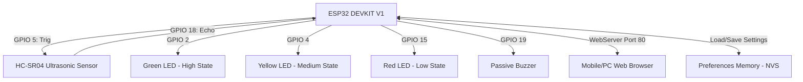
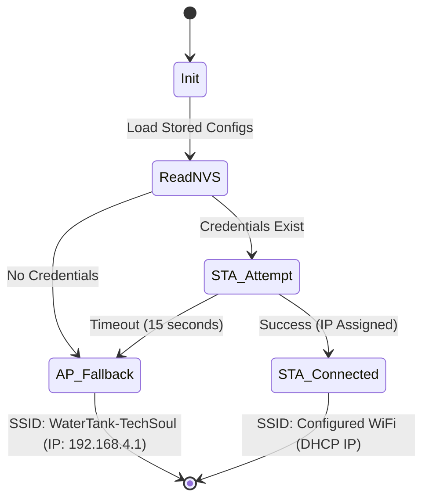

# Smart IoT Water Tank Monitoring System
## User Manual & Technical Documentation

This document provides a comprehensive guide to assembling, configuring, operating, and troubleshooting the **Intelligent IoT Water Tank Monitoring System** powered by the **ESP32 DEVKIT V1** and the **HC-SR04** Ultrasonic Sensor.

---

## Table of Contents
1. [System Architecture & Schematic](#1-system-architecture--schematic)
2. [Hardware Assembly Guide](#2-hardware-assembly-guide)
3. [Firmware Setup & Installation](#3-firmware-setup--installation)
4. [WiFi Provisioning & Dual Modes](#4-wifi-provisioning--dual-modes)
5. [Using the Web Dashboard](#5-using-the-web-dashboard)
6. [API Endpoints Reference](#6-api-endpoints-reference)
7. [Troubleshooting & Diagnostics](#7-troubleshooting--diagnostics)

---

## 1. System Architecture & Schematic

The system uses an **ESP32 DEVKIT V1** micro-controller to periodically measure the distance from the top of the water tank using an ultrasonic transducer. Based on user-configured thresholds, it determines the water level state, updates indicators (LEDs and Buzzer), and serves a live interactive dashboard.



---

## 2. Hardware Assembly Guide

### Pin Connection Reference
Ensure your components are connected according to the table below:

| Component | Component Pin | ESP32 GPIO | Description / Connection Tip |
| :--- | :--- | :--- | :--- |
| **HC-SR04 Sensor** | VCC | **VIN** (5V) | HC-SR04 requires 5V for optimal performance and range. |
| | GND | **GND** | Connect to common Ground. |
| | Trig | **GPIO 5** | Trigger Pin (10us output pulse). |
| | Echo | **GPIO 18** | Echo Pin (Logic converter recommended, see below). |
| **Green LED** | Anode (+) | **GPIO 2** | Indicates **HIGH** Water State (use ~220Ω resistor to GND). |
| **Yellow LED** | Anode (+) | **GPIO 4** | Indicates **MEDIUM** Water State (use ~220Ω resistor to GND). |
| **Red LED** | Anode (+) | **GPIO 15** | Indicates **LOW** Water State (use ~220Ω resistor to GND). |
| **Passive Buzzer**| Pos (+) | **GPIO 19** | Generates alarms (Negative pin connects directly to GND). |

> [!WARNING]
> **5V Logic Safety Tip:** The HC-SR04 sensor operates at **5V** logic levels. The ESP32 pins are **3.3V tolerant only**. While many developers connect the Echo pin directly to the ESP32, it is highly recommended to use a simple voltage divider (e.g., a 1kΩ and a 2kΩ resistor) on the **Echo** line to scale the signal down to ~3.3V, safeguarding the ESP32 GPIO 18 pin from damage.

---

## 3. Firmware Setup & Installation

### Setup Prerequisites
1. Download and install [Arduino IDE 2.x](https://www.arduino.cc/en/software).
2. Install the ESP32 Arduino Core:
   * Go to **File > Preferences** and add the following URL to *Additional Boards Manager URLs*:
     `https://raw.githubusercontent.com/espressif/arduino-esp32/gh-pages/package_esp32_index.json`
   * Open the **Boards Manager** (left sidebar), search for `esp32` by Espressif, and install version **3.3.x or later**.
     *(Note: This project relies on the new LEDC/Tone APIs introduced in ESP32 Core 3.x).*

### Uploading the Code
1. Open the [WaterTankMonitor.ino](file:///c:/xampp/htdocs/dec/WaterTankMonitor.ino) sketch in Arduino IDE.
2. Select your board from **Tools > Board > esp32 > ESP32 Dev Module** (or `DOIT ESP32 DEVKIT V1`).
3. Connect the ESP32 to your PC using a micro-USB data cable.
4. Select the matching COM Port in **Tools > Port**.
5. Open the Serial Monitor (**Tools > Serial Monitor**) and set the baud rate to `115200`.
6. Click the **Upload** button.

---

## 4. WiFi Provisioning & Dual Modes

The system operates using a smart, fail-safe dual WiFi mechanism:



### Accessing the Dashboard via Local Hotspot (AP Mode)
1. If the ESP32 has no saved network settings, it will spin up its own Access Point (hotspot) after 15 seconds.
2. Search for WiFi networks on your phone or PC and connect to:
   * **SSID**: `WaterTank-TechSoul`
   * **Password**: `12345678`
3. Once connected, open a web browser and navigate to: **👉 [http://192.168.4.1](http://192.168.4.1)**

### Accessing the Dashboard via Station Mode (STA Mode)
1. On the dashboard configuration page, enter your home/office WiFi SSID and Password, along with High/Low thresholds.
2. Click **Save Settings & Restart**.
3. The ESP32 will reboot, save the values into persistent flash memory (`Preferences`), and connect to your local WiFi router.
4. Check the Serial Monitor to identify the DHCP-allocated IP address (e.g., `192.168.1.105`). Open this IP in your web browser.

---

## 5. Using the Web Dashboard

The web dashboard is a modern, responsive single-page web app styled with glassmorphism aesthetics. It communicates via async REST requests and updates metrics in real-time once per second.

### Features breakdown:
* **Live Water Tank Graphic**: Displays an animated blue liquid level that rises and falls dynamically matching your tank depth.
* **Live Metrics**: Shows exact distance in centimeters, remaining level percentage, and active operational state.
* **SSID Badge**: Displays current WiFi connection and current operation mode (AP or STA).
* **Hardware Status Indicators**: Mirrors physical hardware states. A green, yellow, or red glow indicates which LED is currently turned on.
* **System Properties**: View the device IP address, system uptime, and last-updated timestamp.
* **System Configuration Panel**: Update and save WiFi settings and water levels locally.
* **Simulation Controls**: Force test scenarios (Auto, High, Medium, Low, Error) to override sensor outputs.
* **Diagnostics Panel**: Run quick diagnostic test cycles on the LEDs, check audio patterns on the buzzer, or force reboot the chip remotely.
* **Live Event Logs**: A scrollable micro-console tracking raw system changes as they occur.

---

## 6. API Endpoints Reference

You can query or command the system programmatically using standard HTTP GET requests:

| Route | Expected Response | Description |
| :--- | :--- | :--- |
| `GET /` | `text/html` | Serves the main responsive HTML panel. |
| `GET /status` | `application/json` | Returns all hardware and software states. (See example below) |
| `GET /settings` | `application/json` | Retrieves currently stored SSID, password, and thresholds. |
| `GET /save` | `application/json` | Saves variables. Required query parameters: `?ssid=SSID&pass=PASS&high=8.0&low=35.0` |
| `GET /test/auto` | `application/json` | Restores normal hardware operation (uses physical HC-SR04 readings). |
| `GET /test/high` | `application/json` | Simulates a HIGH level condition (sensor distance clamped to High threshold). |
| `GET /test/medium`| `application/json` | Simulates a MEDIUM level condition. |
| `GET /test/low` | `application/json` | Simulates a LOW level condition. |
| `GET /test/error` | `application/json` | Simulates a sensor disconnect/failure condition. |
| `GET /test/led` | `application/json` | Cycles LEDs (Green ➔ Yellow ➔ Red) for 1 second each. |
| `GET /test/buzzer`| `application/json` | Cycles through Success, Ambulance, and Error buzzer tone sequences. |
| `GET /restart` | `application/json` | Safely triggers `ESP.restart()` after a 2-second delay. |

### Status API Payload Example
`GET /status` returns:
```json
{
  "distance": 18.52,
  "percentage": 61.0,
  "state": "MEDIUM",
  "high_threshold": 8.00,
  "low_threshold": 35.00,
  "wifi_ssid": "MyLocalWiFi",
  "wifi_ip": "192.168.1.142",
  "wifi_mode": "STA",
  "led_green": 0,
  "led_yellow": 1,
  "led_red": 0,
  "buzzer_mode": "NONE",
  "system_mode": "AUTO",
  "uptime": 724890
}
```

---

## 7. Troubleshooting & Diagnostics

### File and Compilation Locks on Windows
If the compiler displays this warning:
`The process cannot access the file because it is being used by another process. (exit status 1)`
It indicates that background analyzer processes are locking the compiler's temporary binary paths.
1. Close all instances of the **Arduino IDE**.
2. Open **PowerShell** (as Administrator) and run:
   ```powershell
   Stop-Process -Name "arduino-cli", "arduino-language-server" -Force
   ```
3. Re-open Arduino IDE and click compile again.

### Hardware Validation Matrix

If your board is not responding correctly, follow this diagnostic checklist:

| Observation | Probable Cause | Action |
| :--- | :--- | :--- |
| **All LEDs flash / Buzzer beeps continuously** | Ultrasonic Sensor Failure | Check the wiring of `Trig (GPIO 5)` and `Echo (GPIO 18)`. Ensure the sensor VCC is connected to a 5V source (VIN pin). The system flags an `ERROR` state after 3 consecutive read failures. |
| **Web panel doesn't open** | Wrong WiFi network / IP | Ensure your computer/mobile device is on the same WiFi network as the ESP32. In AP mode, you *must* connect to `WaterTank-TechSoul` and browse to `192.168.4.1`. |
| **Settings won't save / Error message** | Validation failure | The High Threshold must always be *less than* the Low Threshold (since the sensor measures distance from the top down; a smaller distance means a fuller tank). Values must also be positive numbers. |
| **Buzzer stays completely silent** | Pin definition / Core version | Ensure you are using **ESP32 Board Core 3.3.x**. Older board cores do not translate `tone()` natively without dedicated LEDC parameters, causing compile or runtime failures on GPIO 19. |
| **Yellow LED stays on / No alerts** | Stuck in Simulation | Click the **AUTO** button on the simulation panel to restore live physical sensor readings. |
